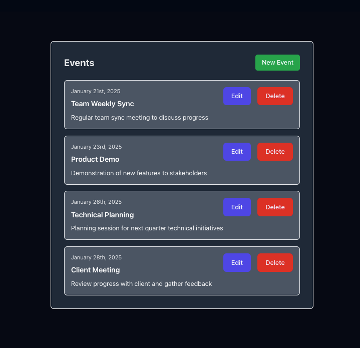

<div align = "center">

<h1><a href="https://github.com/2kabhishek/events-nest">events-nest</a></h1>

<a href="https://github.com/2KAbhishek/events-nest/blob/main/LICENSE">
 </a>

<a href="https://github.com/2KAbhishek/events-nest/graphs/contributors">
 </a>

<a href="https://github.com/2KAbhishek/events-nest/stargazers">
</a>

<a href="https://github.com/2KAbhishek/events-nest/network/members">
 </a>

<a href="https://github.com/2KAbhishek/events-nest/watchers">
 </a>

<a href="https://github.com/2KAbhishek/events-nest/pulse">
 </a>

<h3>Short Sweet Headline 🎇🎉</h3>

<figure>
  
  <br/>
  <figcaption>events-nest in action</figcaption>
</figure>

</div>

events-nest is a `<utility/tool>` that allows `<target_audience>` to `<action>`.

## ✨ Features

- Comes with a ready to go README template
- Works with [mkrepo](https://github.com/2kabhishek/mkrepo)

## ⚡ Setup

### ⚙️ Requirements

- foo >= bar
- bazz

### 💻 Installation

Installing events-nest is as simple as cloning and symlinking!

```bash
git clone https://github.com/2kabhishek/events-nest
cd events-nest
<install_command>
```

## 🚀 Usage

```bash
USAGE:
    events-nest [FLAGS] [OPTIONS]
Example:
    events-nest
```

## 🏗️ What's Next

Planning to add `<feature/module>`.

### ✅ To-Do

- [x] Setup repo
- [ ] Think real hard
- [ ] Start typing

## 🧑‍💻 Behind The Code

### 🌈 Inspiration

events-nest was inspired by `<reason/idea>`.

### 💡 Challenges/Learnings

- The main challenges were `<issue/difficulty>`
- I learned about `<learning/accomplishment>`

### 🧰 Tooling

- [dots2k](https://github.com/2kabhishek/dots2k) — Dev Environment
- [nvim2k](https://github.com/2kabhishek/nvim2k) — Personalized Editor
- [sway2k](https://github.com/2kabhishek/sway2k) — Desktop Environment
- [qute2k](https://github.com/2kabhishek/qute2k) — Personalized Browser

### 🔍 More Info

- [shelly](https://github.com/2kabhishek/shelly) — Command line template
- [tiny-web](https://github.com/2kabhishek/tiny-web) — Web app template

<hr>

<div align="center">

<strong>⭐ hit the star button if you found this useful ⭐</strong><br>

<a href="https://github.com/2KAbhishek/events-nest">Source</a>
| <a href="https://2kabhishek.github.io/blog" target="_blank">Blog </a>
| <a href="https://twitter.com/2kabhishek" target="_blank">Twitter </a>
| <a href="https://linkedin.com/in/2kabhishek" target="_blank">LinkedIn </a>
| <a href="https://2kabhishek.github.io/links" target="_blank">More Links </a>
| <a href="https://2kabhishek.github.io/projects" target="_blank">Other Projects </a>

</div>
